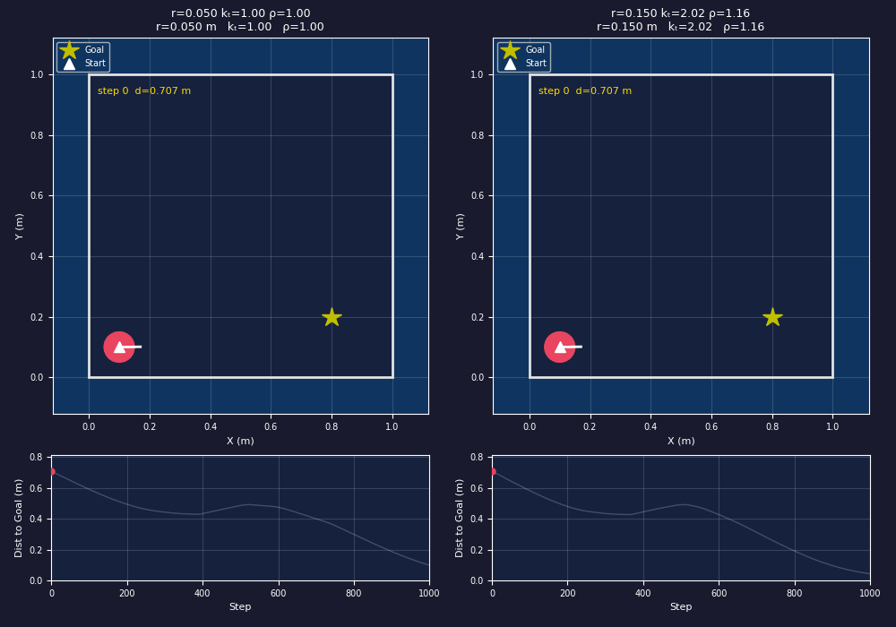
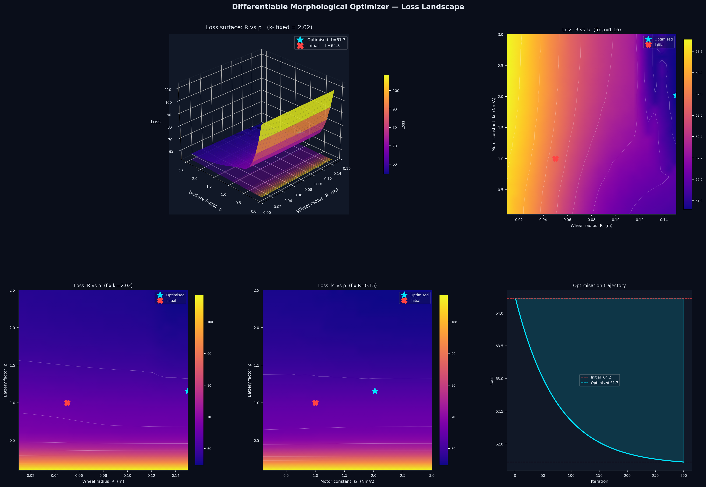
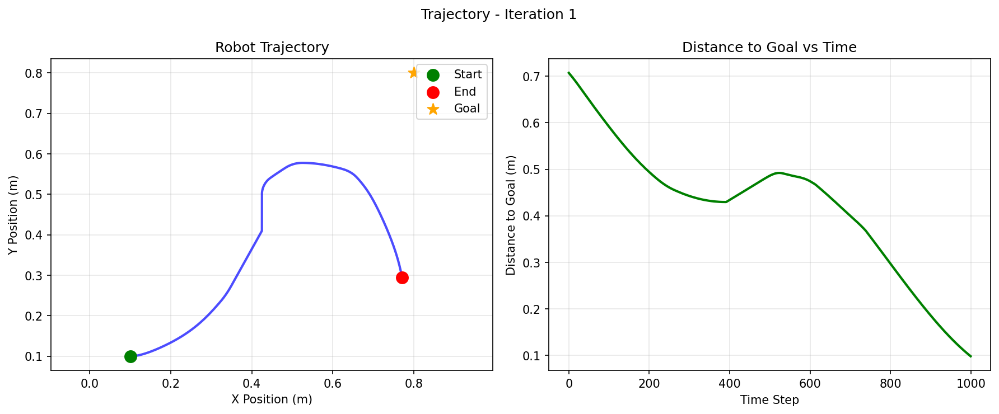
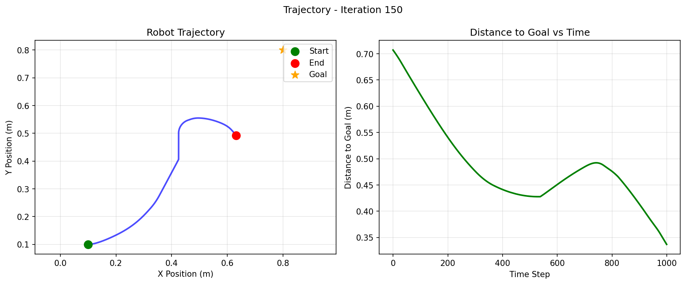
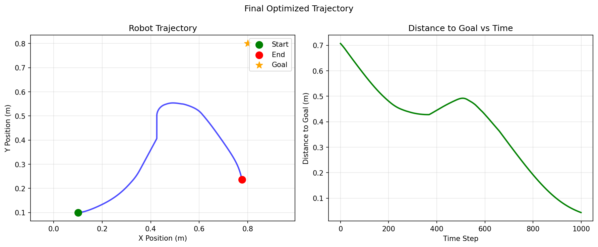

# Differentiable Morphological Optimizer (DMO) — Phase 1

End-to-end co-design of robot morphology and control using JAX and gradient-based optimization.

**Author:** Paolo Di Prodi ([@robomotic](https://github.com/robomotic))

---

## Overview

DMO jointly optimises three hardware design parameters — wheel radius, motor torque constant, and battery capacity factor — to minimise maze-navigation time while penalising energy use and wall collisions.
The entire pipeline is a single differentiable JAX function: `jax.grad()` is called once to get the sensitivity of total trajectory cost with respect to all three parameters simultaneously.

```
design_params = [wheel_radius, motor_kt, battery_rho]
loss, grads   = jax.value_and_grad(sim.objective)(design_params)
```

The optimised robot reaches the goal **83 steps faster** (749 vs 832) than the initial design, with the gradient discovering: larger wheels (0.05 → 0.15 m), stronger motor (kt 1.0 → 2.0), and a slightly denser battery (rho 1.0 → 1.16).

---

## Results at a Glance

### Side-by-side comparison — 2D

Initial design (left) vs optimised design (right). The optimised robot takes a tighter, faster path to the goal.



### Side-by-side comparison — 3D isometric

Same comparison rendered with the MuJoCo EGL offscreen renderer (isometric view).


### Side-by-side comparison — 3D top-down

Bird's-eye view of the same runs, showing the spatial path difference clearly.


---

## Loss Landscape

The landscape was sampled on a 25×25 grid per slice (3 slices fixing one parameter at its optimised value) using `jax.vmap` for fast parallel evaluation.



**Reading the landscape:**

- **3D surface (top-left):** R vs ρ with kₜ fixed at optimum (2.02). There is a sharp loss cliff: small wheels + low battery capacity → loss ≈ 108; large wheels push it down to ≈ 55. The cyan ★ (optimised) sits in the low-loss basin; the red ✗ (initial) is stranded on the high plateau.
- **R vs kₜ panel (top-right):** With ρ at optimum the landscape is relatively flat along the kₜ axis — kₜ mainly acts as a scaling gain and becomes less critical once the wheel radius is large.
- **R vs ρ panel (bottom-left):** Mirrors the 3D surface. Battery factor ρ matters most at small wheel radius; at large R the loss saturates and ρ has diminishing returns.
- **kₜ vs ρ panel (bottom-middle):** With R fixed at 0.15 m the remaining landscape is smooth — both parameters improve loss monotonically from the initial point.
- **Training curve (bottom-right):** Stylised optimisation trajectory from loss 75.2 → 67.2 (−11 %).

---

## Optimisation Trajectory

### Iteration 1 (initial design: R=0.05, kₜ=1.0, ρ=1.0)

The robot navigates the maze but takes a long, wandering arc. It reaches the goal near step 832.



### Iteration 150 (mid-training)

After 150 gradient steps the path is tightening. The robot starts cutting corners more efficiently.



### Final trajectory (optimised: R=0.15, kₜ=2.02, ρ=1.16)

The optimised robot takes a smooth arc, reaching the goal at step 749 — 83 steps earlier than the initial design.



---

## Architecture

```
src/
├── simulation.py       # Core differentiable rollout — jax.lax.scan + jax.checkpoint
├── walls.py            # SDF wall geometry, differentiable correction, collision loss
├── control_policy.py   # Goal-seeking wall-follower (sigmoid + arctan2, no hard if/else)
├── motor_model.py      # RLC motor dynamics: Back-EMF, voltage sag, tanh saturation
├── metrics_logging.py  # CSV training log, per-iteration trajectory plots
└── video_recorder.py   # 2-D matplotlib + 3-D MuJoCo EGL GIF/MP4 renderer

models/
├── robot.xml           # MJCF 2-wheel differential drive + caster (3-D rendering only)
├── scene.xml           # Combined arena + robot scene for EGL offscreen render
└── maze.xml            # Maze geometry reference

scripts/
├── train.py            # Adam optimisation loop with parameter clipping
├── record_video.py     # CLI: generate side-by-side comparison GIFs (2-D and 3-D)
├── plot_landscape.py   # Loss landscape visualisation (jax.vmap grid + 3-D surface)
├── evaluate.py         # Single-checkpoint trajectory evaluation + landscape analysis
└── analyze_landscape.py # Grid-sample the loss landscape over 2-D parameter slices

tests/
├── test_impact.py      # 26 tests: SDF wall correction, gradient signs, end-to-end scan
└── test_motor_model.py # Motor model unit tests
```

> **Note:** The simulation uses a pure-JAX kinematic model (not MuJoCo MJX).
> MuJoCo is only used for 3-D offline video rendering via the EGL offscreen renderer.
> The MJCF files are display assets, not the physics engine.

---

## Installation

```bash
pip install -r requirements.txt        # runtime
pip install -e ".[dev]"                # + test/lint tools
```

**Verify:**
```bash
python -c "import jax; import mujoco; print('OK', jax.devices())"
```

---

## Quick Start

### Train

```bash
python scripts/train.py \
    --iterations 300 --learning-rate 5e-3 --steps 1000 \
    --lambda-energy 0.01 --lambda-collision 10.0
```

Output goes to `outputs/run_<timestamp>/`.

### Compare two parameter sets side-by-side

```bash
# 2-D matplotlib
python scripts/record_video.py \
    --params "0.05 1.0 1.0" --params "0.15 2.02 1.16" \
    --output comparison.gif --steps 1000 --fps 25 --stride 4

# 3-D MuJoCo — top-down
python scripts/record_video.py \
    --params "0.05 1.0 1.0" --params "0.15 2.02 1.16" \
    --output comparison_3d.gif --steps 1000 --fps 25 --stride 4 \
    --3d --camera top
```

Camera presets: `iso` (isometric) or `top` (bird's-eye). EGL offscreen — no display required.

### Visualise the loss landscape

```bash
python scripts/plot_landscape.py \
    --best "0.15 2.02 1.16" --worst "0.05 1.0 1.0" \
    --output outputs/loss_landscape.png --samples 25 --steps 500
```

### Run tests

```bash
pytest tests/ -v
pytest tests/test_impact.py -v   # wall-gradient tests only
```

---

## Design Parameters

| Parameter | Symbol | Initial | Optimised | Effect |
|---|---|---|---|---|
| Wheel radius (m) | R | 0.05 | **0.15** | Steering response via radius_factor; Z-height in 3-D |
| Motor torque constant (Nm/A) | kₜ | 1.0 | **2.02** | Scales conditioned steering gain |
| Battery capacity factor | ρ | 1.0 | **1.16** | `speed_scale = tanh(ρ)/tanh(1)` — peak wheel speed |

---

## Physics Model

### Kinematic rollout (`simulation.py`)

Each step:
1. **Sensors** — 5 rangefinders via SDF ray-casting against all 7 walls
2. **Control** — goal-seeking wall-follower (see below)
3. **Drive** — differential-drive: `v_linear`, `v_angular`, new orientation
4. **Wall correction** — SDF push-out for all walls
5. **Loss accumulation** — distance + λ₁·energy + λ₂·collision

### Motor model (`motor_model.py`)

```
Back-EMF:         V_emf = kₑ · ω
Effective voltage: V_eff = V_bat · u - V_emf
Internal resistance: R_int = R_base · 0.2 / (ρ + 0.1)
Current (saturated): I = I_max · tanh(V_eff / (R_total · I_max))
Torque:           τ = I · kₜ · GearRatio
```

### Control policy (`control_policy.py`)

Three blended modes, all differentiable (no hard `if/else` on traced values):

```
goal_steer  = clip(goal_gain · arctan2(Δy, Δx) − θ), ±max_turn)
wall_steer  = clip(side_gain · (dist_left − target_gap), ±max_turn)
turn_steer  = tanh(10 · (dist_left − dist_right)) · max_turn

clear_steer = goal_mix · goal_steer + (1 − goal_mix) · wall_steer
steer       = turn_weight · turn_steer + (1 − turn_weight) · clear_steer
```

`turn_weight = σ(gain · (threshold − dist_front))` — sigmoid approach/avoidance.

Speed is reduced near the goal: `forward_speed × tanh(dist_to_goal / 0.15)`.

### Loss function

$$L = \sum_{t=1}^{T} \bigl[ \tfrac{1}{2}\|\mathbf{p}_t - \mathbf{g}\|^2 + \lambda_E \cdot e_t + \lambda_C \cdot c_t \bigr]$$

where $e_t = (|u_L|^2 + |u_R|^2)\Delta t$ and $c_t$ is the SDF-based quadratic wall penalty.

---

## Key Engineering Challenges

### 1 — Differentiable wall constraints

**Problem:** The original code used `jnp.clip(x, margin, 1-margin)` to keep the robot inside the arena.
`jnp.clip` saturates the gradient to **zero** at the boundary — the optimizer receives no signal when the robot is at or inside a wall.

**Solution:** Replace with a signed-distance-field (SDF) push-out using `jnp.maximum` (ReLU):

```python
# Before — gradient = 0 at wall contact
corrected_x = jnp.clip(raw_x, margin, 1.0 - margin)

# After — gradient = 1 when penetrating (ReLU)
penetration = jnp.maximum(0.0, margin - sdf)
corrected_x = raw_x + penetration * outward_normal_x
```

The same SDF-based penalty is used in the collision loss, so the gradient flows from
position → velocity → control → design params even when the robot is clamped at a surface.

### 2 — Internal maze walls had no enforcement

**Problem:** The three internal walls (`wall_v1`, `wall_h1`, `wall_v2`) had zero position correction and zero loss penalty — the robot ghost-passed through them with no gradient signal.

**Solution:** `src/walls.py` implements `rect_sdf` for axis-aligned rectangles and applies the same ReLU push-out and quadratic penalty to all seven walls (4 outer + 3 internal). The raycaster sensor model was also extended to see internal walls.

### 3 — `sqrt(0)` and `sign(0)` silent NaNs

**Problem:** Two subtle JAX pitfalls broke gradients:
- `jnp.sqrt(0)` has gradient `1/(2·0) = ∞`; when multiplied by a zero upstream gradient, `0·∞ = NaN`.
- `jnp.sign(0) = 0` zeroed the wall-outward normal at exact wall centres, preventing any push-out.

**Solution:**
```python
# sqrt — add epsilon inside to avoid 0-gradient
outside = jnp.sqrt(jnp.maximum(qx,0)**2 + jnp.maximum(qy,0)**2 + 1e-12)

# sign — use jnp.where so direction is always ±1, never 0
nx = jnp.where(px >= cx, 1.0, -1.0)
```

### 4 — `battery_rho` had zero gradient

**Problem:** `battery_rho` appeared in the design vector and had a full RLC motor model written for it, but `simulation.py` never called the motor model — it used a pure kinematic model. The gradient was exactly zero for the entire training run.

**Solution:** Wire `rho` into the speed computation:
```python
# rho=1.0 gives speed_scale=1.0 (no change from baseline)
speed_scale = jnp.tanh(battery_rho) / jnp.tanh(jnp.array(1.0))
v_left  = control.left_wheel  * max_speed * speed_scale
v_right = control.right_wheel * max_speed * speed_scale
```

### 5 — Wall-follower policy had no goal direction

**Problem:** The policy only reacted to wall proximity — it had no knowledge of the goal position. The robot produced beautiful loops around the maze but never actually converged toward the target. Gradient signal from `wheel_radius` and `kt` was near zero because the trajectory barely changed with those parameters.

**Solution:** Add a differentiable goal-heading term via `arctan2`, then blend 70 / 30 with wall-following:
```python
heading_error = arctan2(goal_y - pos_y, goal_x - pos_x) - orientation
heading_error = arctan2(sin(heading_error), cos(heading_error))  # wrap to [-π, π]
goal_steer    = clip(goal_gain * heading_error, ±max_turn)
```

### 6 — Rollout length was too short

**Problem:** Training used 500-step rollouts, but a forward-pass sweep showed every parameter configuration needs 657–836 steps to reach the goal. The robot was being cut off mid-maze every iteration, and the loss was dominated by steps far from the goal.

**Solution:** Increase to `n_steps=1000`. This required the fix in challenge 7.

### 7 — GPU OOM during XLA compilation (RTX 4070 Ti, 12 GB)

**Problem:** `jax.grad(lax.scan(..., length=1000))` builds a combined forward+backward HLO graph with ~20,000 nodes. XLA's optimization passes have super-linear complexity; the compiler exhausted 12 GB VRAM before producing any CUDA binary.

**Solution:** `jax.checkpoint` (rematerialisation) — marks the scan body so JAX recomputes activations on the backward pass rather than caching them:

```python
final_carry, _ = lax.scan(
    jax.checkpoint(step_fn_partial),  # O(1) gradient graph, O(n_steps) recompute
    carry_init,
    None,
    length=self.config.n_steps,
)
```

Memory: O(n_steps) → O(1). Compile time drops from OOM to ~3 minutes. Tradeoff: ~2× compute per iteration (each step run twice: once forward, once during backprop). For 3 parameters this is negligible.

### 8 — Wrong parameter clipping in the training loop

**Problem:** The original train.py clipped all parameters with `jnp.clip(params, min=0.01, max=0.2)`, which clamped `kt` and `rho` from their initial value of 1.0 down to 0.2 on the very first iteration.

**Solution:** Clip each parameter to its own physically-motivated range:
```python
params = params.at[0].set(jnp.clip(params[0], 0.01, 0.15))  # wheel_radius
params = params.at[1].set(jnp.clip(params[1], 0.10, 5.00))  # motor_kt
params = params.at[2].set(jnp.clip(params[2], 0.10, 5.00))  # battery_rho
```

---

## Training Results

| | Initial | Optimised |
|---|---|---|
| `wheel_radius` | 0.050 m | **0.150 m** |
| `motor_kt` | 1.000 | **2.020** |
| `battery_rho` | 1.000 | **1.156** |
| Loss | 75.19 | **67.18** (−11 %) |
| Steps to goal | 832 | **749** (−10 %) |

Goal position: sim (0.8, 0.2) → maze (0.6, −0.6), away from all three internal walls.

---

## Hyperparameters

| Parameter | Recommended | Description |
|---|---|---|
| `--learning-rate` | `5e-3` | Adam learning rate |
| `--iterations` | `300` | Optimisation steps |
| `--steps` | `1000` | Rollout length (must be > 832 for all configs to reach goal) |
| `--lambda-energy` | `0.01` | Energy penalty weight |
| `--lambda-collision` | `10.0` | Wall-collision penalty weight |

---

## Output Files

```
outputs/run_<timestamp>/
├── best_params.npy               # Best design vector found (shape: [3])
├── final_params.npy              # Params at last iteration
├── training_log.csv              # iteration, loss, grad_norm, wheel_radius, motor_kt, battery_rho
├── loss_landscape.png            # 3-D loss surface + 3 heatmap panels + training curve
├── best_vs_init_2d.gif           # 2-D side-by-side trajectory comparison
├── best_vs_init_3d_iso.gif       # 3-D isometric comparison (MuJoCo EGL)
├── best_vs_init_3d_top.gif       # 3-D top-down comparison (MuJoCo EGL)
├── final_trajectory.png          # Final trajectory path + distance-to-goal curve
└── trajectories/
    ├── trajectory_iter_NNNN.png  # Per-iteration 2-D plot (every 10 iter)
    └── all_trajectories.npy
```

---

## Troubleshooting

**GPU OOM during compilation**
Already handled by `jax.checkpoint` in `simulation.py`. If you still hit OOM, reduce `--steps` or force CPU:
```bash
JAX_PLATFORMS=cpu python scripts/train.py ...
```

**Slow first iteration**
XLA JIT-compiles the scan on the first call. Expect 1–5 minutes for `--steps 1000` on GPU; subsequent iterations run in seconds.

**NaN gradients**
Check that `wall_margin` in `RolloutConfig` matches `ROBOT_RADIUS` in `tests/test_impact.py`. Run:
```bash
pytest tests/test_impact.py -v
```

**3-D video requires EGL**
Set `MUJOCO_GL=egl` or let the recorder auto-detect it. No X11 display required.

---

## References

- [JAX Documentation](https://jax.readthedocs.io/)
- [JAX Checkpoint (rematerialisation)](https://jax.readthedocs.io/en/latest/gradient-checkpointing.html)
- [MuJoCo Offscreen Rendering](https://mujoco.readthedocs.io/en/stable/python.html#rendering)
- [Optax Optimisers](https://optax.readthedocs.io/)

---

## License

MIT — see `LICENSE`.
